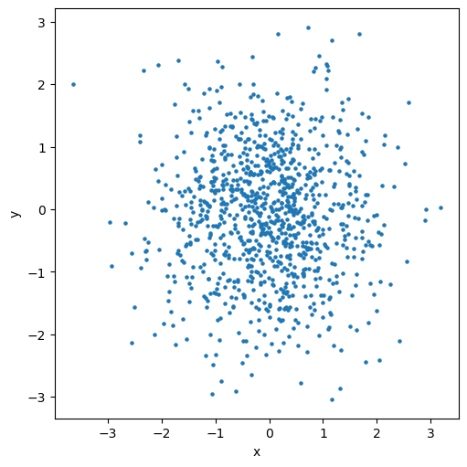

An Example Plot
===============

.. code:: ipython3

    import matplotlib.pyplot as plt
    import numpy as np

We use ``numpy``\ s default rng to generate random data.

.. code:: ipython3

    rng = np.random.default_rng(42)

We draw 1000 data points from normal distributions:

.. code:: ipython3

    data = rng.normal(size=(1000, 1000))
    x = data[0]
    y = data[1]

Plotting the Data
-----------------

.. code:: ipython3

    fig, ax = plt.subplot_mosaic("a", figsize=(5, 5), layout="constrained")
    
    ax["a"].scatter(x, y, s=5)
    ax["a"].set(
        xlabel="x",
        ylabel="y",
    )

.. parsed-literal::

    [Text(0.5, 0, 'x'), Text(0, 0.5, 'y')]

